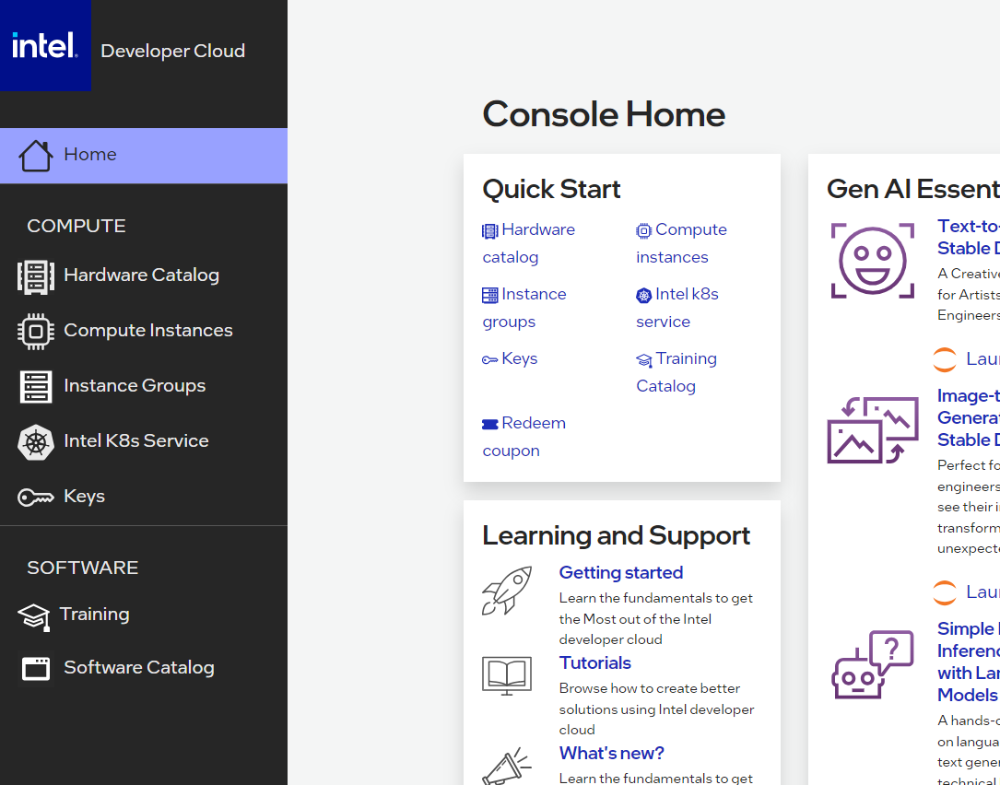
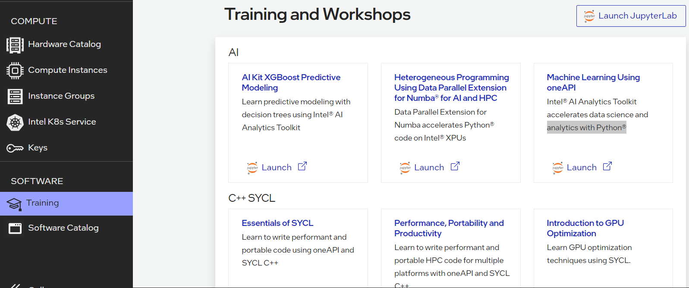
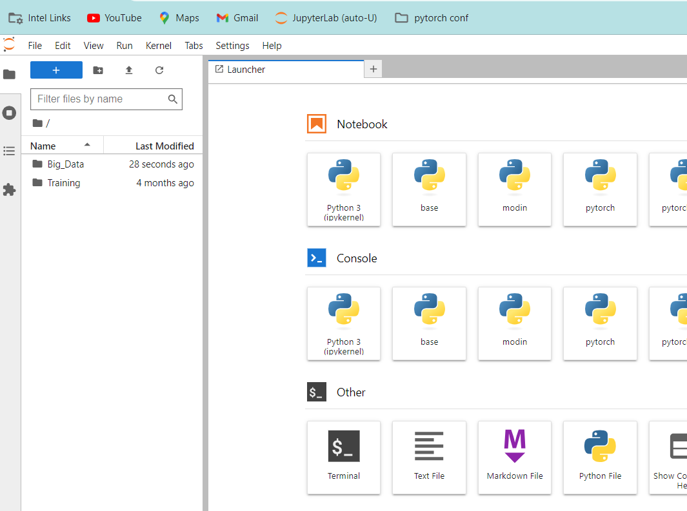

# Python-Loop-Replacement-with-NumPy-and-PyTorch
Python Loop Replacement with NumPy and PyTorch - Fancy Slicing, UFuncs and equivalent, Aggregations, Sorting and more...

# Intel Developer Cloud

- Register and login for free access to Cloud.Intel.com

- Click Training on Intel Developer Landing Page

- Click Training Icon, then Launch JupyterLab

- Launch Terminal Session

  

# Preparation (from Terminal on Intel Developer Cloud)
- cd ~
- mkdir NP
- cd NP
- git clone https://github.com/IntelSoftware/Python-Loop-Replacement-with-NumPy-and-PyTorch.git
- cd Python-Loop-Replacement-with-NumPy-and-PyTorch

